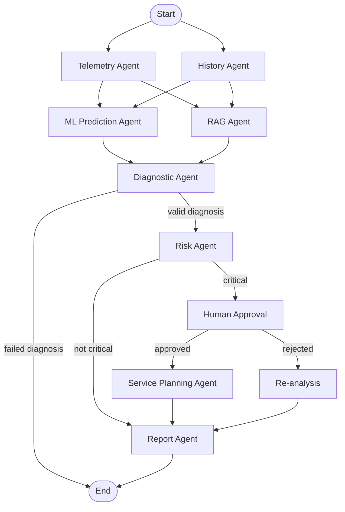

# Agents and Workflow

This page describes the LangGraph workflow in `src/workflow.py`.

## Workflow Graph

Telemetry and history start in parallel. Their results feed ML and RAG; the
diagnostic node receives their outputs along with the ML prediction. Failed
diagnosis ends the run. Valid diagnosis proceeds to risk routing. Critical risk
requires a human decision; other risk levels go directly to reporting. Approval
leads to service planning, while rejection adds feedback to the diagnosis and then
reports.

## Agent Responsibilities

| Agent or node | Responsibility | Tools and data |
| --- | --- | --- |
| Telemetry Agent | Applies thresholds to current readings and records abnormalities. | Calls `analyze_telemetry` directly. Checks oil pressure, coolant temperature, vibration, and battery voltage. |
| History Agent | Passes through maintenance and previous-fault data and adds a trend summary. | Reads `history` from workflow state. No external history lookup is currently connected. |
| RAG Agent | Builds a query from telemetry abnormalities and retrieves maintenance guidance. | Calls the versioned retriever using the active version; falls back to legacy retrieval before a version is active. Logs version and document IDs. See [RAG Versioning](rag-versioning.md). |
| ML Agent | Estimates failure probability and maps it to LOW, MEDIUM, or HIGH. | Calls `predict_failure_probability`; this is a model function rather than a LangChain tool. |
| Diagnostic Agent | Reasons over telemetry, history, RAG evidence, and ML probability. | LLM may use the diagnostic tools listed in [Tools](tools.md). Retries failed attempts up to its configured limit. |
| Risk Agent | Calculates a deterministic score from abnormalities, ML probability, and previous faults. | Calls `send_approval_request` for critical risk and routes for approval. |
| Human Approval | Captures approval/rejection and optional feedback. | The web and terminal flows are implemented separately. |
| Re-analysis | Adds rejection feedback to the diagnosis. | No tool calls. The current graph then proceeds to reporting. |
| Service Planning Agent | Produces an actionable service plan using diagnosis and RAG evidence. | LLM may use the service planning tools listed in [Tools](tools.md). |
| Report Agent | Produces the final report and writes the audit log. | LLM may use report-delivery tools when requested. S3 upload is attempted if a bucket is configured. |

The graph is compiled with an in-memory checkpointer for the web application and
without a checkpointer for the non-web workflow.

## Workflow State

`MaintenanceState` carries input vehicle/request details and intermediate telemetry,
history, RAG evidence, ML output, diagnosis, risk decision, human decision, service
plan, report, tool results, and audit log. Versioned RAG adds `rag_version` and
`rag_doc_ids` to this state.